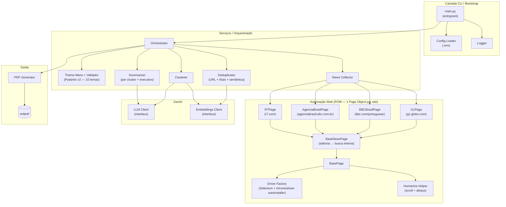
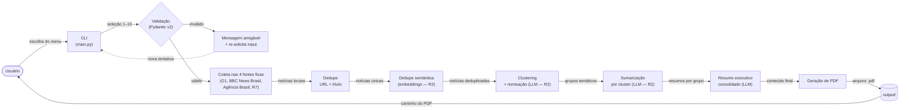

# Arquitetura — RPA_SMART_NEWS

> Diagramas de **componentes** e **fluxo de dados** do MVP, em
> **Mermaid** — simples, legível e versionável diretamente em
> Markdown.
>
> Documento **vivo** — atualizado conforme a arquitetura evolui.

---

## Sumário

- [1. Diagrama de componentes](#1-diagrama-de-componentes)
- [2. Diagrama de fluxo de dados](#2-diagrama-de-fluxo-de-dados)
- [3. Legenda](#3-legenda)
- [Histórico de revisões](#histórico-de-revisões)

---

## 1. Diagrama de componentes

Visão estática dos módulos do projeto, suas responsabilidades e
relacionamentos.

---

## 2. Diagrama de fluxo de dados

Visão dinâmica de como os dados percorrem o pipeline, do input do
usuário até a entrega do PDF.

---

## 3. Legenda

| Notação | Significado |
|---|---|
| `[Texto]` | Componente / etapa de processamento |
| `([Texto])` | Ator externo (ex.: usuário) |
| `{Texto}` | Decisão / ramificação |
| `[(Texto)]` | Armazenamento (sistema de arquivos, base) |
| `subgraph` | Agrupamento lógico (camada / módulo) |
| `-->|label|` | Fluxo com rótulo descrevendo o dado/evento |

---

## Histórico de revisões

| Versão | Data | Autor | Descrição |
|---|---|---|---|
| 0.1 | 2026-04-30 | Leonardo Santos | Versão inicial: componentes e fluxo de dados. |
| 0.2 | 2026-04-30 | Leonardo Santos | Substitui guardrail LLM por **menu determinístico** (10 temas + N dias) nos dois diagramas. |
| 0.3 | 2026-04-30 | Leonardo Santos | Inclui **Pydantic v2** nos labels de validação e o limite **1–10 dias**. |
| 0.4 | 2026-04-30 | Leonardo Santos | Troca `webdriver-manager` por **`chromedriver-autoinstaller`** no nó `Driver Factory`. |
| 0.5 | 2026-04-30 | Leonardo Santos | **Opção E aplicada**: discovery e coleta migram para `news.google.com`; introduz nós `GoogleNewsPage`, `Adapter Registry`, `GenericNewsAdapter` e (futuros) adapters curados. Filtro de janela passa a ser **local** sobre `published_at`. |
| 0.6 | 2026-04-30 | Leonardo Santos | **Reset arquitetural**: remove integração com Google (`GoogleNewsPage`, `Adapter Registry`, `GenericNewsAdapter`, filtro de janela). Volta para **POM por site fixo** (G1, BBC News Brasil, Agência Brasil, R7), com `BaseNewsPage` que tenta editoria → busca interna. Remove o nó "número de dias" do fluxo — a única entrada do usuário é o tema. |
